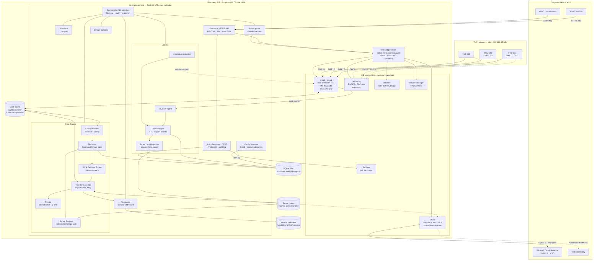
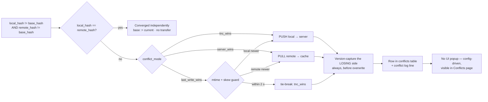
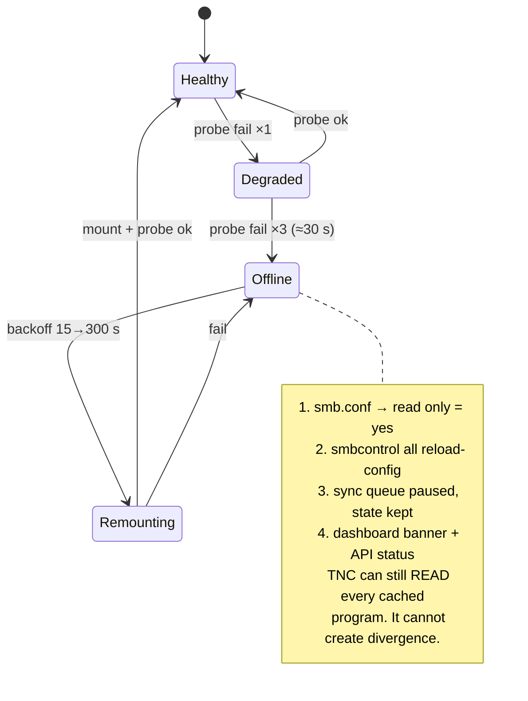
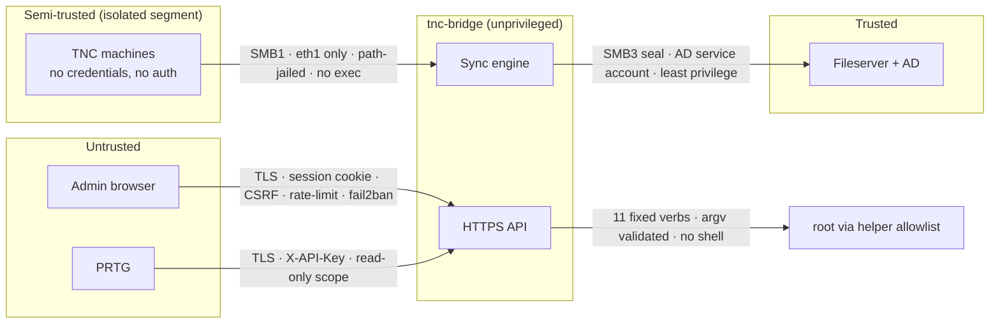

# TNC Network Bridge — Architecture

**Status:** Approved for implementation · **Version:** 1.0 · **Date:** 2026-09-07

---

## 1. The core insight

The naive reading of the requirement is "Server ↔ Local ↔ TNC = three copies, three-way sync". That is not
what we build, and getting this right removes about half the complexity.

**There are only two copies of the data:**

1. **Server share** — the corporate SMB 3.1.1+ share, mounted on the Pi as a POSIX path via `mount.cifs`.
2. **Local cache** — a directory on the Pi's SSD/SD which *is simultaneously* the directory Samba exports
   to the TNC machines over SMB 1.0.

The TNC does not get its own third copy. When a TNC writes a program, it writes **directly into the local
cache** through Samba. Our inotify watcher sees it immediately. So the sync engine is a **two-endpoint
bidirectional reconciler**, and the "TNC side" is an *event source* (who has what open, who wrote what),
not a sync endpoint.

**Second insight:** we do not implement SMB at all in Node.js.
- SMB 1.0 server → **Samba `smbd`/`nmbd`**, pinned to the TNC interface, `server max protocol = NT1`.
- SMB 3.1.1 client → **Linux kernel `cifs.ko`** via `mount.cifs`, which gives us encryption, Kerberos/NTLMSSP,
  and — critically — real SMB2 byte-range locks from `fcntl()`.

Node.js orchestrates, decides, and manages. It never speaks wire protocol.

---

## 2. Component diagram



### Layer responsibilities

| Layer | Runs as | Responsibility | Never does |
|---|---|---|---|
| **OS services** | root (systemd) | Wire protocol, packet filtering, addressing | Business logic |
| **Privileged helper** | root (sudo allowlist) | Exactly 11 whitelisted, argument-validated operations | Accept free-form shell input |
| **Node application** | `tncbridge` (unprivileged, `CAP_NET_BIND_SERVICE`) | All decisions, state, API, UI | Speak SMB; run as root |
| **Frontend SPA** | Browser | Presentation only | Hold secrets; make decisions |

---

## 3. Data flow

### 3.1 Server → TNC (a programmer publishes a new NC program)

```mermaid
sequenceDiagram
  autonumber
  participant SRV as Fileserver (SMB3)
  participant SCAN as Server Scanner
  participant IDX as File Index (SQLite)
  participant DIFF as Decision Engine
  participant XFER as Transfer Executor
  participant CACHE as Local cache
  participant SMBD as Samba (NT1)
  participant TNC as TNC 640

  SRV->>SCAN: scan tick (default 15 s, adaptive)
  SCAN->>SCAN: walk mount, stat(size, mtime)
  SCAN->>IDX: upsert remote{size,mtime}
  IDX->>DIFF: remote != base, local == base
  DIFF->>DIFF: verdict = PULL (no conflict)
  DIFF->>XFER: enqueue(PULL, rel_path, priority)
  XFER->>XFER: check lock table — path locked by TNC?
  XFER->>CACHE: stream → .tnc-tmp-<rand>, throttled
  XFER->>XFER: verify size + xxhash64
  XFER->>CACHE: rename() — atomic, TNC never sees partial
  XFER->>IDX: base := remote := local; state = synced
  XFER-->>SMBD: (no action — same directory)
  TNC->>SMBD: DIR / open → sees complete file
```

Key points:
- The TNC **never observes a partial file**: writes land on a temp name and are `rename()`d, which is atomic
  on ext4 and invisible to an SMB directory listing until complete.
- If the path is currently **locked by a TNC**, the pull is deferred (re-queued with backoff) rather than
  overwriting a program a machine is actively running. This is a hard safety rule.

### 3.2 TNC → Server (an operator edits at the machine)

```mermaid
sequenceDiagram
  autonumber
  participant TNC as iTNC 530
  participant SMBD as Samba (NT1)
  participant AUD as full_audit ingest
  participant LMGR as Lock Manager
  participant PROJ as Lock Projection
  participant WATCH as Cache Watcher
  participant DIFF as Decision Engine
  participant VER as Versioning
  participant SRV as Fileserver

  TNC->>SMBD: SMB_COM_OPEN 12345.H (write)
  SMBD->>AUD: open|ok|12345.H  (syslog LOCAL5)
  AUD->>LMGR: acquireLock(path, origin=tnc, ip, smb_pid)
  LMGR->>PROJ: project lock to server
  PROJ->>SRV: create sidecar .~lock.12345.H# (+ optional fcntl byte-range)
  Note over DIFF: PULLs for this path are now blocked

  TNC->>SMBD: write… write… close
  SMBD->>AUD: close|ok|12345.H
  SMBD-->>WATCH: inotify IN_CLOSE_WRITE
  WATCH->>WATCH: awaitWriteFinish (stability 750 ms)
  WATCH->>DIFF: local changed
  AUD->>LMGR: releaseLock(path) after linger (default 5 s)

  DIFF->>DIFF: local != base, remote == base → PUSH
  DIFF->>VER: capture pre-image of remote as version
  DIFF->>SRV: tmp write + rename (throttled)
  PROJ->>SRV: remove sidecar lock
  DIFF->>DIFF: base := local := remote; state = synced
```

### 3.3 Conflict path (both sides changed since last sync)



**Non-negotiable rule:** the losing side is *always* written to the version store before it is overwritten.
No conflict resolution mode may destroy data irrecoverably.

### 3.4 Failover to read-only



---

## 4. Technology stack & the reasoning behind it

### 4.1 SMB — the two decisions that matter most

| Need | Chosen | Rejected | Why |
|---|---|---|---|
| **SMB 1.0 server for TNC** | **Samba `smbd` 4.17+, `server min/max protocol = NT1`** | node-smb-server, custom impl | No production-grade SMB1 *server* exists in Node. Samba is the only implementation HEIDENHAIN controls are actually tested against. Non-negotiable. |
| **SMB 3.1.1 client for server** | **kernel `mount.cifs` (cifs-utils)** | `node-smb2` / `@marsaud/smb2`; `smbclient` CLI | `node-smb2` is unmaintained, SMB2-only, no SMB3 encryption, no Kerberos, and known to corrupt >2 GB transfers. `smbclient` costs a process spawn per operation and cannot be watched. `mount.cifs` gives us SMB 3.1.1 + `seal` encryption + Kerberos, turns the share into an ordinary POSIX path (so `fs`, streams, and hashing all "just work"), and — uniquely — translates `fcntl()` byte-range locks into real SMB2 LOCK requests the Windows server honours. |

**Mandatory `mount.cifs` options** (each one is load-bearing):

```
vers=3.1.1,seal,soft,retrans=2,timeo=30,actimeo=1,noserverino,nobrl=0,
iocharset=utf8,uid=tncbridge,gid=tncbridge,file_mode=0660,dir_mode=0770,
credentials=/etc/tnc-bridge/creds/<share>.cred
```

- `soft` — **the single most important option.** A `hard` mount that loses the server puts our process into
  uninterruptible `D` state inside a `stat()` call, which hangs the Node event loop with no possible recovery
  short of reboot. `soft` makes I/O return `EIO` after `timeo`, which we can catch. Never use `hard`.
- `nobrl=0` (default) — keeps byte-range lock forwarding enabled; required for the Phase-2 real-lock feature.
- `noserverino` — avoids inode-number churn confusing the watcher across reconnects.
- `actimeo=1` — short attribute cache so the scanner sees fresh mtimes.
- `seal` — forces SMB3 encryption on the wire (this is the whole security point of the product).

**`smb.conf` essentials for the TNC side:**

```ini
[global]
  server min protocol = NT1
  server max protocol = SMB3          # modern TNCs negotiate up; iTNC 530 falls back to NT1
  ntlm auth = yes                     # required — iTNC 530 cannot do NTLMv2
  lanman auth = no                    # keep off unless a specific control demands it
  server signing = disabled           # NT1 clients cannot sign
  interfaces = eth1                   # TNC side only
  bind interfaces only = yes          # smbd must NEVER listen on the LAN side
  unix charset = UTF-8
  dos charset = CP850                 # HEIDENHAIN codepage — mismatch = mangled filenames
  unix extensions = no
  disable netbios = no                # iTNC 530 needs NetBIOS name resolution (nmbd)
  vfs objects = full_audit
  full_audit:prefix = %I|%u|%S
  full_audit:success = open close write pwrite rename unlink mkdir rmdir
  full_audit:failure = none
  full_audit:facility = LOCAL5
  full_audit:priority = NOTICE
```

`bind interfaces only = yes` with `interfaces = eth1` is a **security requirement, not a preference**: an
SMB1 listener reachable from the corporate LAN would recreate exactly the vulnerability this product exists
to eliminate. It is enforced in the config generator and asserted by an integration test.

### 4.2 Sync strategy

**Custom diff engine over a SQLite index. Not rsync.**

`rsync` was rejected because it requires `rsyncd` or SSH on the far end — a Windows/AD fileserver offers
neither, only SMB. Running `rsync` against a CIFS mount degrades to a full-file copy anyway, so its delta
algorithm buys nothing while costing us process management and unparseable progress output. And NC programs
are kilobytes: delta transfer is pointless. What we actually need — bidirectional reconciliation, per-file
conflict verdicts, lock awareness, version capture, throttling — is precisely what rsync does not provide.

The engine keeps a **three-value tuple per path**: `base` (last confirmed-synced state), `local`, `remote`.
Comparing all three is what distinguishes "changed on one side" (safe) from "changed on both" (conflict).
A two-value comparison cannot tell these apart and would silently lose edits.

**Change detection is asymmetric, by necessity:**

| Endpoint | Mechanism | Why |
|---|---|---|
| Local cache | **chokidar, native inotify**, `awaitWriteFinish` | Real-time, zero cost. TNC writes are seen in milliseconds. |
| Server mount | **periodic scan** (`readdir` + `stat`, default 15 s, adaptive 5–120 s) | inotify does **not** fire for changes made by *other* clients on a CIFS mount — cifs.ko only surfaces locally-originated events. Anyone who watches a CIFS mount with inotify and believes it works has a data-loss bug waiting. Polling is the only correct option. |

Scan cost is bounded by keeping the index in SQLite and comparing `(size, mtime)` first; `xxhash64` is
computed only when that cheap check indicates change. Measured target: **10 000 files scanned in < 2 s** on a Pi 5.

### 4.3 Full stack

| Concern | Choice | Note |
|---|---|---|
| Runtime | **Node.js 22 LTS** (NodeSource) | Spec says 18+; Node 18 is EOL. 22 satisfies "18+" and is supported through 2027. |
| Language | TypeScript 5.x, `strict`, `noUncheckedIndexedAccess` | Project references: `shared` → `backend` / `frontend`. |
| DB | **better-sqlite3**, WAL | Synchronous API removes a whole class of race conditions; ARM64 prebuilds exist (install.sh installs `build-essential` as fallback). |
| Migrations | Hand-rolled numbered runner (`migrations/NNN_*.sql`) | ~80 lines; no ORM. Deliberately no Prisma/TypeORM — they add 40 MB and a codegen step to a Pi appliance for no gain. |
| Web server | **Express 4** + `node:https` | Boring on purpose. Helmet, compression, `express-rate-limit`. |
| Validation | **Zod**, schemas in `src/shared/` | One schema definition validates the HTTP body, types the API client, and drives the form. |
| Password hash | **`@node-rs/argon2`** (argon2id) | Prebuilt `linux-arm64-gnu` — no compiler needed at install time. |
| Hashing | **`hash-wasm`** (xxhash64 + sha256) | Pure WASM: no native build on ARM64. xxhash64 for change detection, sha256 for version blob addressing. |
| Logging | **pino** → journald + rotating JSON files + SQLite sink + plaintext `auth.log` | Four sinks, one logger. `auth.log` exists purely to be regex-matched by Fail2Ban. |
| Watcher | **chokidar 3** | `usePolling: false` on cache; the server side does not use chokidar at all. |
| Scheduler | **croner** | Zero deps, DST-correct, TS-native. Chosen over `node-cron` for missed-run semantics. |
| Frontend | **React 18 + Vite + TypeScript** | |
| Styling | **Tailwind CSS + Radix UI primitives** | Rejected MUI: ~300 KB gzipped of runtime CSS-in-JS on a device serving over a slow factory LAN. Radix gives accessible behaviour with no visual weight. |
| Data fetching | **TanStack Query** + native **EventSource** (SSE) | SSE, not WebSocket: traffic is server→client only, it survives proxies, and it reconnects itself. |
| Charts | **Recharts** | |
| Tests | **Jest + ts-jest**, **Supertest**, **Vitest + Testing Library**, **Testcontainers** (dockerised Samba) | 80 % coverage target. |
| Process mgmt | **systemd** (`Restart=always`, `WatchdogSec=60`, hardening directives) | No PM2 — systemd is already there and integrates with journald. |
| Network config | **`nmcli`** | Bookworm-based RPi OS Lite uses NetworkManager, not `dhcpcd`. Writing `dhcpcd.conf` on a current image does nothing. |
| DHCP (TNC side) | **dnsmasq** | Interface-bound; also provides the DNS/NetBIOS help old controls want. |
| Firewall | **nftables** (`table inet tnc_bridge`) | Debian's default since Buster. Default policy `accept` per spec; our table is additive and independently flushable. |

---

## 5. Security model

### 5.1 Trust boundaries



### 5.2 Authentication & session

- **Single admin account** (per spec — no user management). Password: **argon2id**, m=64 MiB, t=3, p=4.
- Session ID: 256 bits from `crypto.randomBytes`, stored **hashed** in SQLite; cookie is
  `HttpOnly; Secure; SameSite=Strict; Path=/`.
- **Idle timeout** (default 30 min, configurable 5 min–24 h) and **absolute timeout** (default 12 h).
- **CSRF**: double-submit token, required on every non-GET; SameSite=Strict is defence in depth, not the control.
- **Rate limiting**: 5 login attempts / 15 min / IP, then 429. Every failure writes
  `authentication failure for user admin from <IP>` to `/var/log/tnc-bridge/auth.log`.
- **Fail2Ban** ships as a first-class deliverable: `filter.d/tnc-bridge.conf` + `jail.d/tnc-bridge.local`
  (`maxretry=5`, `findtime=600`, `bantime=3600`). Unban is exposed in the UI.
- **API tokens** for PRTG/Prometheus: `tnb_<32 bytes base62>`, stored as SHA-256, scoped read-only,
  sent as `X-API-Key`. Shown exactly once at creation.

### 5.3 TLS

Self-signed (generated at install, 10-year, SAN = hostname + all interface IPs + `localhost`) **or** custom
cert/key/chain uploaded through the UI. **Explicitly no Let's Encrypt** — the device lives on an internal
network with no public DNS or inbound :80, so ACME cannot work; offering it would be a broken feature.
Uploaded material is validated (key matches cert, not expired, parseable) *before* the old cert is replaced,
so a bad upload can never lock the admin out. TLS 1.2 minimum, 1.3 preferred, modern cipher suite only.
HSTS, CSP (`default-src 'self'`, no inline script), `X-Content-Type-Options`, `X-Frame-Options: DENY`.

### 5.4 Privilege separation

The Node service runs as **`tncbridge`**, not root. It binds :443 via
`AmbientCapabilities=CAP_NET_BIND_SERVICE`. Everything requiring root goes through
`/usr/local/lib/tnc-bridge/helper` invoked under a sudoers rule that permits **only that one binary with no
arguments passed through the shell**. The helper accepts a **fixed set of 11 verbs**:

`mount-share · unmount-share · reload-samba · write-samba-config · write-dnsmasq-config ·
apply-network · write-nft-ruleset · fail2ban-unban · install-cert · service-restart · apply-update`

Every argument is validated against a strict allowlist regex *inside the helper* (share names
`^[a-zA-Z0-9_-]{1,32}$`, interfaces matched against real `/sys/class/net` entries, paths canonicalised and
required to sit under a known root). The helper never invokes a shell — `execve` with an argv array only.
This is the primary defence against a web-tier RCE becoming root.

### 5.5 Secrets

AD service-account passwords are encrypted **AES-256-GCM** with a key in `/etc/tnc-bridge/secret.key`
(`0600 root:tncbridge`, generated at install from `getrandom`). They are never returned by the API — the
config endpoint emits `"********"` and accepts a sentinel meaning "unchanged". `mount.cifs` requires
plaintext at mount time, so a credentials file is written `0600`, consumed, and the fact that it must exist
on disk is documented honestly rather than hidden. Recommend an AD account with **read/write on exactly one
share and nothing else** — no interactive logon, no admin rights.

### 5.6 File access

Samba's TNC export is `wide links = no`, `follow symlinks = no`, path-jailed to the cache root, with
`veto files` covering `.tnc-tmp*`, the sidecar lock pattern, and the version store. Every path arriving from
any source (SMB audit event, API request, DB row) is canonicalised and re-checked to be inside its share root
before any `fs` call. Directory traversal is treated as a hard error, logged to the audit trail, never a warning.

---

## 6. Project structure

```
tnc-network-bridge/
├── src/
│   ├── shared/                      # imported by BOTH backend and frontend
│   │   ├── schemas/                 # Zod: config, share, lock, api envelopes
│   │   ├── types/                   # inferred TS types, enums, constants
│   │   └── api-contract.ts          # endpoint → request/response type map
│   ├── backend/
│   │   ├── index.ts                 # entrypoint, DI container, lifecycle
│   │   ├── sync/
│   │   │   ├── watcher.ts           # chokidar on local cache
│   │   │   ├── scanner.ts           # periodic walk of CIFS mount
│   │   │   ├── file-index.ts        # base/local/remote triple in SQLite
│   │   │   ├── diff-engine.ts       # verdict computation (pure, fully unit-tested)
│   │   │   ├── transfer.ts          # tmp+rename copy, verify, retry
│   │   │   ├── throttle.ts          # token bucket + concurrency
│   │   │   ├── echo-guard.ts        # self-write suppression
│   │   │   └── orchestrator.ts      # per-share state machine
│   │   ├── smb/
│   │   │   ├── mount-manager.ts     # mount/unmount/probe/health
│   │   │   ├── smbconf-generator.ts # smb.conf rendering
│   │   │   ├── samba-control.ts     # reload, smbstatus --json parsing
│   │   │   ├── audit-ingest.ts      # full_audit syslog → events
│   │   │   └── connectivity-test.ts # smbclient -L, AD/protocol probe
│   │   ├── locking/
│   │   │   ├── lock-manager.ts      # acquire/release/TTL/expiry
│   │   │   ├── tnc-lock-source.ts   # audit + smbstatus reconciliation
│   │   │   └── server-projection.ts # sidecar + optional byte-range
│   │   ├── versioning/
│   │   │   ├── blob-store.ts        # content-addressed sha256 store
│   │   │   ├── version-manager.ts   # capture / list / restore
│   │   │   └── retention.ts         # prune by count/age/size
│   │   ├── scheduling/
│   │   │   ├── scheduler.ts         # croner engine + persistence
│   │   │   ├── lock-windows.ts      # scheduled lock/unlock periods
│   │   │   └── jobs/                # scan, prune, update, restart, metrics
│   │   ├── updates/
│   │   │   ├── github-client.ts     # releases, checksums
│   │   │   ├── updater.ts           # download → verify → swap → health → rollback
│   │   │   └── version.ts
│   │   ├── config/
│   │   │   ├── db.ts                # better-sqlite3 + WAL + pragmas
│   │   │   ├── migrations/          # 001_init.sql …
│   │   │   ├── config-manager.ts    # typed get/set, defaults, change events
│   │   │   └── secrets.ts           # AES-256-GCM envelope
│   │   ├── security/
│   │   │   ├── auth.ts              # argon2id, login flow
│   │   │   ├── session-store.ts
│   │   │   ├── csrf.ts
│   │   │   ├── cert-manager.ts      # self-signed gen + custom upload
│   │   │   ├── firewall.ts          # nftables ruleset
│   │   │   ├── fail2ban.ts
│   │   │   └── audit-log.ts
│   │   ├── network/
│   │   │   ├── nm-manager.ts        # nmcli profiles, IPv6 toggle
│   │   │   ├── dhcp-manager.ts      # dnsmasq config + leases
│   │   │   └── interfaces.ts
│   │   ├── monitoring/
│   │   │   ├── metrics.ts           # collector + rollups
│   │   │   ├── system-info.ts       # disk, cpu, mem, temp, uptime
│   │   │   └── health.ts
│   │   ├── web/
│   │   │   ├── server.ts            # https, helmet, static SPA
│   │   │   ├── middleware/          # auth, validate, error, audit, ratelimit
│   │   │   ├── routes/              # one file per resource
│   │   │   ├── sse.ts               # event bus → EventSource
│   │   │   └── setup-wizard.ts
│   │   ├── helper/                  # compiled separately, runs as root
│   │   │   ├── main.ts              # 11 verbs, argv allowlist, no shell
│   │   │   └── validators.ts
│   │   └── lib/                     # logger, errors, fs-safe, result type
│   ├── frontend/
│   │   ├── main.tsx
│   │   ├── pages/                   # Dashboard Config Logs Monitoring Locks Versions Setup Login
│   │   ├── components/              # ui/ (Radix+Tailwind) + domain widgets
│   │   ├── hooks/                   # useApi useSSE useConfig useShares
│   │   ├── api/                     # typed client generated from shared contract
│   │   └── types/
│   └── cli/
│       └── config-wizard.ts         # headless setup fallback
├── scripts/
│   ├── install.sh                   # the one-liner target
│   ├── systemd-setup.sh
│   ├── uninstall.sh
│   └── backup-restore.sh
├── packaging/
│   ├── systemd/tnc-bridge.service
│   ├── sudoers/tnc-bridge
│   ├── fail2ban/{filter.d,jail.d}/
│   └── templates/{smb.conf.hbs,dnsmasq.conf.hbs,nftables.conf.hbs}
├── tests/{unit,integration,api,fixtures}/
└── docs/{ARCHITECTURE,IMPLEMENTATION_PLAN,TASKS,API,INSTALL,HEIDENHAIN}.md
```

Runtime paths on the Pi:

| Path | Contents |
|---|---|
| `/opt/tnc-bridge/releases/<ver>/` · `current` symlink | Application code (atomic update swap) |
| `/etc/tnc-bridge/` | `secret.key`, `creds/*.cred`, `certs/` |
| `/var/lib/tnc-bridge/` | `bridge.db`, `versions/` blob store |
| `/var/log/tnc-bridge/` | `app.log`, `sync.log`, `auth.log` |
| `/srv/tnc/<share>/` | Local cache = Samba export root |
| `/mnt/tnc-server/<share>/` | CIFS mount of the corporate share |
